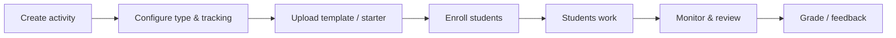

# Instructor and TA workflows — overview

Instructors and teaching assistants use ProctorIDE to **design assessments**, **deliver** them to the right students, **observe** integrity-aligned signals, and **review** submissions.

## Core lifecycle

Detailed: [Activity lifecycle](activity-lifecycle.md).

## Guides by task

| Goal | Document |
|------|----------|
| Long homework / multi-file | [Assignments & projects](assignments-projects.md) |
| Practice sets | [Challenges](challenges.md) |
| Short checks | [Quizzes](quizzes.md) |
| High-stakes | [Tests & exams](tests-exams.md) |
| Rosters and codes | [Enrollment](enrollment.md) |
| Starter repos / files | [Templates](templates.md) |
| During / after | [Monitoring & review](monitoring.md) |

## Transparency obligation

Before students begin work, they should see **what is monitored** for that activity type. Align your syllabus language with [Tracking by activity type](../../transparency/tracking-by-activity-type.md).

## Compliance reminders

- Only grant **TA** or **instructor** roles to people covered by your institution’s policies.
- Export/deletion requests follow [Data requests](../../procedures/data-requests.md) once your deployment registers a process.
